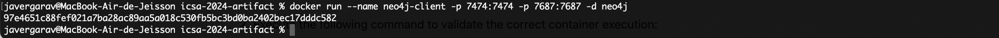
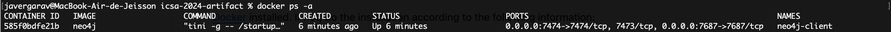
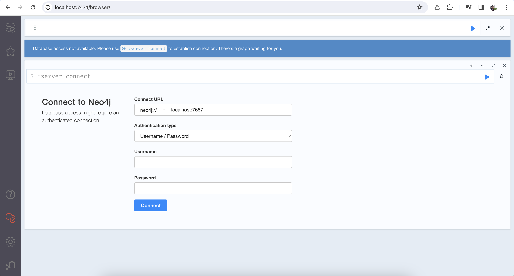

# INSTALL

## Requirements

[Docker](https://www.docker.com/) installed. If not, do the installation according to the following information:

* For a **Linux**-based operating system: [Docker Engine](https://docs.docker.com/engine/install/).
* For **MacOS** operating system: [Docker Desktop](https://www.docker.com/products/docker-desktop/).
* For **Windows** operating system: [Docker Desktop](https://www.docker.com/products/docker-desktop/).

## Execution

In the operation system **Terminal**: 

**1.** Execute the following command:

> docker run --name neo4j-client -p 7474:7474 -p 7687:7687 neo4j

After running the command, the terminal will appear as follows:

**2.** Execute the following command to validate the correct container execution:

> docker ps -a

The container should appear as follows:

**2.** In a **web browser**: open the following URL:

> [http://localhost:7474/](http://localhost:7474/)

The Neoj4 client should appear as follows:

**3.** Connect to Neo4j using the following credentials:

- **Connect URL:**
> neo4j+s://e57b39bb.databases.neo4j.io:7687

- **Authentication type:**
> Username / Password

- **Username:**
> neo4j

- **Password:**
> PASSWORD
