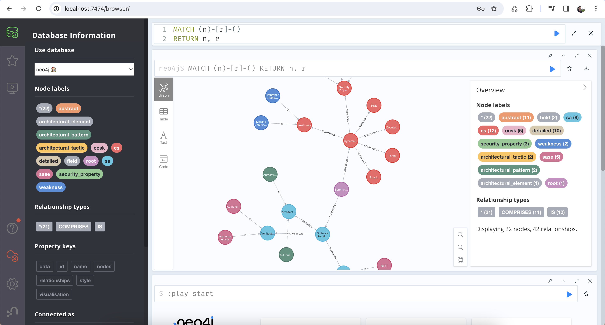

# ICSA 2024 - Artifact

Artifact for the [21st IEEE International Conference on Software Architecture (ICSA 2024)](https://conf.researchr.org/home/icsa-2024)

## Accepted Paper

- **Track:** Research Papers.
- **Type:** Short Paper.
- **Name**: Sarch-Checks: A Method for Checking Software Architecture Security Properties using a Knowledge Graph.
- **Authors**: Jeisson Vergara-Vargas, Salah Sadou, Chouki Tibermacine, Felipe Restrepo-Calle.

## Artifact Details

### Name

Sarch-Knows: Knowledge Graph for Supporting Sarch-Checks Method.

### Abstract

Sarch-Checks is a method that allows checking whether a security property is present in the architectural design of a given software system. To achieve this, Sarch-Checks receives an architecture description as input and makes use of a knowledge graph called Sarch-Knows, which models different security scenarios, based on different elements of software architecture and cybersecurity. This artifact presents a database instance in Neo4j, which models the Sarch-Knows knowledge graph. The database allows the execution of queries in Cypher language, the key element for the checking process carried out by Sarch-Checks.

### Overview

In order to interact with Sarch-Knows, it is necessary to use a Neo4j client, which allows connection and interaction with the respective database. In this case, the Neo4j client is a web application deployed in a Docker container. General aspects are described below:

**1.** Develop the [INSTALL](INSTALL.md) guide.

**2.** Recognize the Neo4j client dashboard:

**Notation:**

1. Neo4j client URL.
2. Current user of the database.
3. Node labels of the database. A **node label** is a way to categorize or group nodes based on their common characteristics or properties.
4. Relationship types of the database. A **relationship** is a directed connection between two nodes.
5. Property keys of the database. **Property keys** are used to define the attributes or properties of nodes and relationships.
6. Field to write Cypher queries. [Cypher](https://neo4j.com/developer/cypher/) is a declarative graph query language developed by Neo4j for querying, updating, and managing graph data stored in a Neo4j graph database.
7. Button to run Cypher queries.
8. Space where the results of Cypher queries appear.
9. Information about the connection made to the database.

**3.** Execute the first Cypher query:

    MATCH (n)-[r]-()
    RETURN n, r

The goal of this query is to get all the nodes and relationships in the database.

### Queries

A set of queries that can be executed, using the Cypher language in the Neo4j client, are described in [EXAMPLES](EXAMPLES.md).